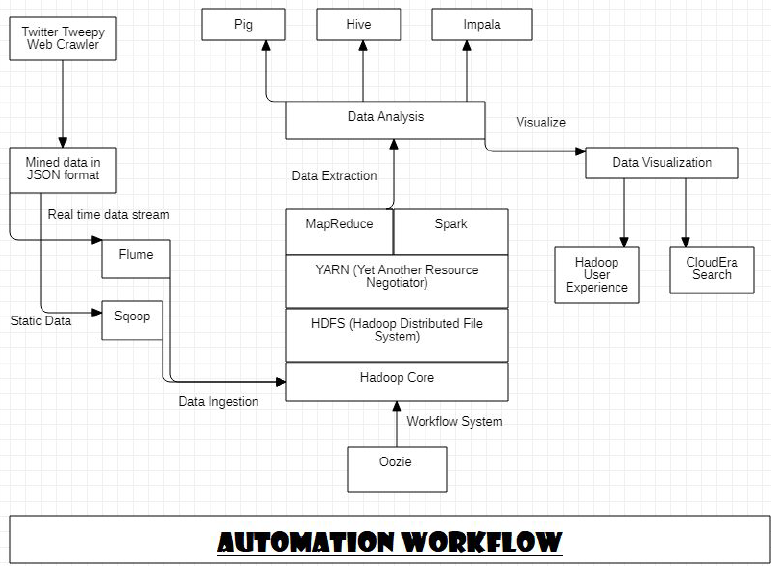

# DevOps pipeline for Real Time Social/Web Mining

## Workflow 

## Technology Stack

* **Git:** Version Control

* **GitHub:** Distributed Development and SCM

* **Python:** Tweepy and Pandas library for Data Mining using Twitter API and Matplotlib library for Data Visualization

* **Java:** Big Data cleaning and stripping workflow using MapReduce

* **Apache Maven:** Build Automation Tool for Java

* **GitHub Actions:** Continuous Integration tool for Apache Maven build whenever Java source code is pushed.

* **Hadoop:** Setup a HDFS cluster for Big Data Analytics.

* **Likert Scaling:** Data Classification into 5 class model.

* **Python:** Sentimental Analysis programming

* **Docker:** Cross-platform package image pushed to DockerHub.

* **DataDog:** Monitoring tool for our Docker Package.

* **Docker-Compose:** Integrating Docker Image of StatusNeo Twitter Mining and DataDog Agent

* **HashiCorp Packer:** Creating cross platform deployable images

* **HashiCorp Terraform:** Infrastructure as Code

* **Ansible:** Configuration Management and Automated Provisioning

## Important Source files and dependencies

1. [pom.xml](pom.xml) - Setup Apache Maven

2. [helloworld.java](src/main/java/pkg/HelloWorld.java) - Basic Java project setup

3. [maven.yml](.github/workflows/maven.yml) - setup GitHub Actions

4. [crawler.py](src/crawler/Crawl.py) - Web Crawler in Python to extract twitter data based on specific hashtags.

5. [info.csv](src/crawler/info.csv) - data file created as an output for the crawler and to be sent to the HDFS core for processing

6. MapReduce functionalities in Java

* [Map Function](src/main/java/pkg/Map.java)
  
* [Reduce Function](src/main/java/pkg/Reduce.java)
  
* [Main Java Code](src/main/java/pkg/WordCountDriver.java)
  
7. [Sentimental Analysis in Python](src/sentimental_analysis)

* Convolutional Neural Networks
* Decision Tree
* SVM
* Pre-Processing
* Random Forests
* Naive Bayes
* XGBoost

8. [matplotlib.py](src/visualization/matplotlib.py) - Data Visualization using matplotlib in python

9. Hadoop Setup

* [Hadoop Core Setup](hdfs_setup/core-site.xml)
* [HDFS Setup](hdfs_setup/hdfs-site.xml)
* [MapReduce in Task Tracker](hdfs_setup/TaskTracker_MapReduce.xml)
* [MapReduce in Job Tracker](hdfs_setup/JobTracker_MapReduce.xml)

10. [Dockerfile](Dockerfile)

* [Install.sh](install.sh) to provision the docker image locally before pushing it to [DockerHub](https://hub.docker.com/r/shreyasingh18/statusneo).c

11. [Automation.sh](Automation.sh) Run locally on Linux based machine.

12. [docker-compose.yml](docker-compose.yml) for DataDog x Docker integration.

13. [Ansible Playbook](ansible/playbook.yml)

14. [Packer Image Builder](packer/template.json)

15. [Infrastructure as Service using Terraform](terraform)

## Backlog

[x] Setting up Apache Maven for Java project - User Interface and MapReduce functions

[x] Setting up GitHub repository workflow

[x] Setting up GitHub Actions for automation

[x] Creating a web crawler in Python using Tweepy library to fetch data based on some parameter.

[] Create a User Interface

[x] Create a HDFS cluster for MapReduce functionality and program Hadoop MapReduce in Java

[x] Setup Hadoop Core and create Job Tracker and Task Trackers for the project

[x] Implement MapReduce in HDFS using Java to count the frequency of significant words in Data dictionary, in Twitter string

[x] Configure Apache Maven with MapReduce codes and install Apache Hadoop Jar dependency

[x] Configure MapReduce code in GitHub Actions for automation

[x] Automate the Big Data pipeline till MapReduce using GitHub Actions

[] Use Data Ingestion tools like Flume to send data from crawler to HDFS at real time

[x] WAP in Java to implement MapReduce from JSON file extracted from crawler to find the frequency of significant words - Textual Analysis

[] Data Classification - create a multi-class data dictionary for sentimental analysis - currently for words (in future, we might extend it for phrases and sentences for improved accuracy)

[x] Data Predicition - Using the KNN algorithm in Python to find the relation between tweets and their sentiments.

[x] Data Visualization - Using the Python **matplotlib** library to implement visualization.

## How to Contribute

It is an open source project. Open for everyone.

Follow these contribution [guidelines](CONTRIBUTING.md).

## License

MIT [License](LICENSE), copyrighted to StatusNeo, forked from Storms in Brewing (2019-2020) 
